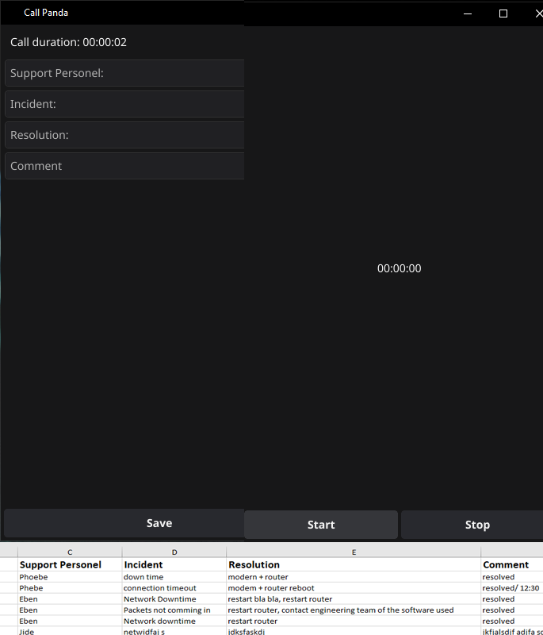

<h1 align="center">
            Call Panda - aka Vatsca
</h1>

   

 

## Tools:

- **UI:** Fyne toolkit
- **Data sheet:** Excelize
- **Logic:** Go
   

## Features:

Call Panda was created to aid the Engineering Support Team at Vas Technologies in automating the call entry process and generating data about support services. This enables management to make better-informed decisions about the support services rendered to clients.

## Why💁‍♂️💁‍♀️:

I'm currently doing my SIWES program as a network intern at Vas Technologies, a small network services company. This is in fulfillment of getting a degree at the university. In the monthly meeting this July, the MD/CEO asked the support engineering team lead to provide him with support analytics, such as average call time, frequency of incidents received, and frequency of client calls. However, the support team did not have an automated way of gathering this data. They had to manually note the time when calls came in, monitor when the calls ended, and manually enter these details into Excel.
  
But with Call Panda, they only have to leave the desktop application running. When a call comes through, they hit the start button, hit the stop button when it ends, and enter specific details of the call. It automatically saves this entry in an Excel sheet.